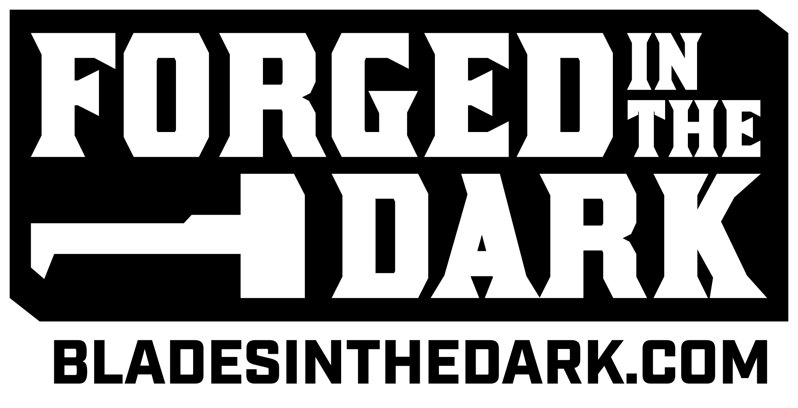

# Shift-X

Shift-X is a superheroic roleplaying game Forged in the Dark. It is about a team of people with extraordinary powers trying to create and deepen their relationships while foiling the plans of devious villains.  

## Touchstones

The Marvel Cinematic Universe, especially the Avengers movies, are the Platonic ideal for the Shift-X experience. 

## Forged in the Dark

This game is derived from Blades in the Dark by John Harper. It makes use of the Blades in the Dark System Reference Document which can be found at [bladesinthedark.com](http://bladesinthedark.com).

Blades in the Dark™ is a trademark of One Seven Design. The Forged in the Dark Logo is © One Seven Design, and is used with permission.

## License

Blades in the Dark is licensed under a Creative Commons 3.0 license. 
Shift-X is licenced under a Creative Commons 4.0 license.

## Outline

1. basics
2. characters
   1. threat level
   1. powers
   1. background & origins
   1. nemesis
   1. relationships
1. teams
1. events <!-- what is the structure of an event?  -->
   1. incitement
   1. action sequences <!--how much can we flex what an action sequence is? Can we think of the final scene in Jessica jones as an action sequence? It would be cool if we  could.-->
   1. transitions
      1. stress relief
      1. resource acquisition
      1. gathering information/tracing
   1. resolution <!-- A scene/sequence where the stakes are the highest -->
   1. downtime